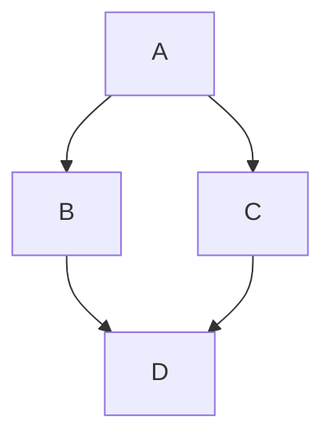

- [jackgruber](https://jackgruber.github.io/2021-05-09-Embed-Mermaid-in-Jekyll-without-plugin/){:target="_blank"}

Here is a simple flow chart:

```mermaid
graph TD;
    A-->B;
    A-->C;
    B-->D;
    C-->D;
```
